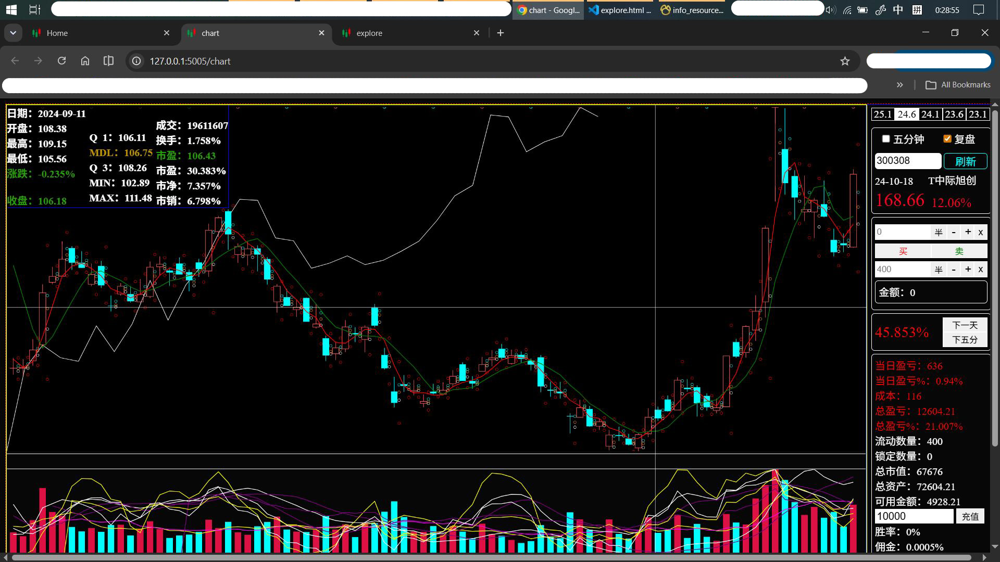
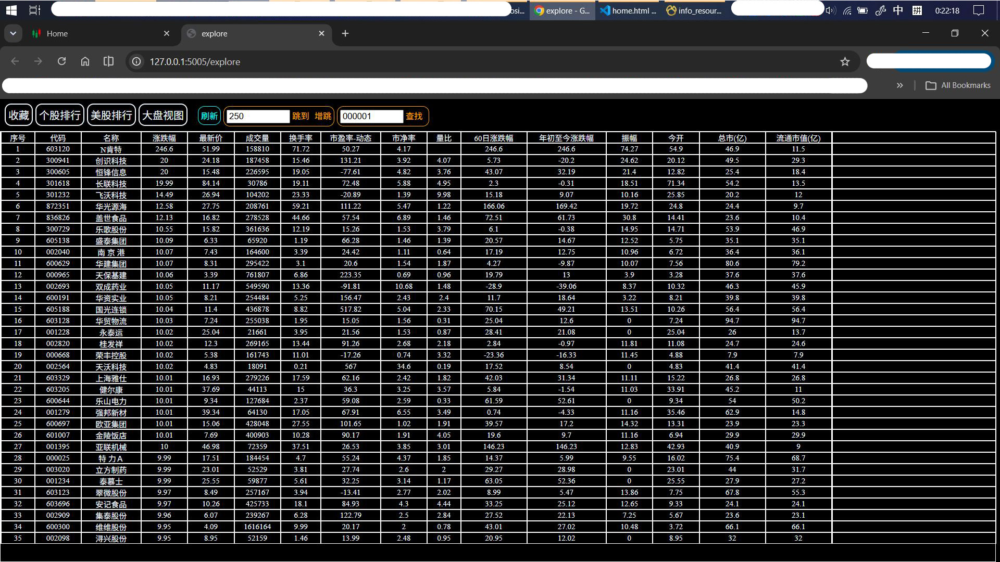
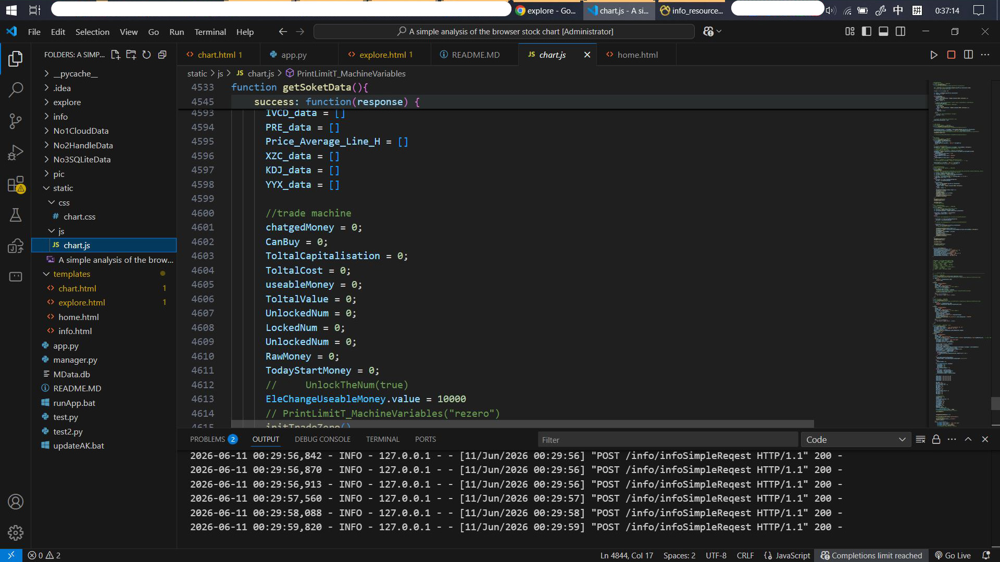
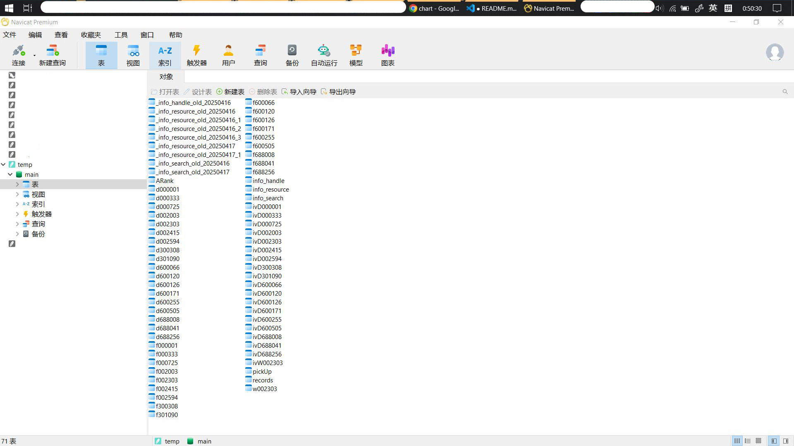

# A simple analysis of the browser stock chart
# 浏览器股票图表简单分析

A simple A-share stock chart display and analysis tool, with note-taking and keyword quick search, built with a local Python backend and web frontend.
一个简单的A股股票图表展示和简单分析，以及记录笔记和关键字快捷搜索的，本地Python后端和Web前端的案例。

This is a nearly well-developed project, not one that is 100% completed.
这是一个几近完善开发的项目，并不是百分百开发完成的项目。

项目的主要数据来源：AKShare，Baostock等，衷心感谢。
Main data sources: AKShare, Baostock, etc. Sincere thanks to these projects.

项目借助了KIMI AI，作为辅助。
This project was assisted by KIMI AI.

项目内有多个test文件，为方便调试，并未进行删除，不影响正常运行。
Multiple test files are included for debugging convenience and have not been removed; they do not affect normal operation.

主要代码量在chart.js里。里面有部分代码为作废的代码，未进行删除。
The main codebase is in chart.js. Some obsolete code remains and has not been removed.

The readme document was manually written after a six-month interval and may not match the actual situation, It cannot be regarded as 100% correct.
readme文档为时隔半年后手动书写，可能与实际存在或者错别字，不能视为百分百正确。
---

## Quick Start
## 快速运行

Download all project files locally without changing the directory structure, ensuring all Python third-party dependencies are installed.
将本文件所有文件，不动结构，下载至本地，在确保Python第三方库的依赖已经安装。

Method 1: Run `python app.py` directly.
This is the most essential way of operation. If other methods fail, use this method directly.
方法一：直接python运行app.py 这是最本质的运行方法。如果其他方法失败则直接使用这个方法。

Method 2: Double-click `runApp.bat` to run. A command window will pop up. If it stops after a few lines, press Enter to continue output.
方法二：双击运行runApp.bat脚本，直接运行，运行时弹出命令行窗口，如果命令一打开就只输出几句后不动，回车促使他继续输出

For online data updates, first select an option in the `getSoketKData` function in `app.py` (instructions are provided inside). Then update the AKShare and Baostock libraries, Especially akshare. Double-click `updateAK.py` to auto-update AKShare.
如果需要进行联网更新数据的话，首先得在app.py的文件的getSoketKData函数进行选择，选择其一即可，其内有说明。之后，更新akshare和baostock等库t，特别是akshare。双击updateAK.py可运行自动更新akshare。

Data retrieval may fail if libraries are not updated.
如果不更新，运行时可能获取数据失败。

运行起来后，打开浏览器访问：http://127.0.0.1:5005 访问home导航页面
After running, open your browser and visit: http://127.0.0.1:5005 to access the home navigation page.

---

## Features
## 功能特性

- -------CHART
-  **Display Historical Charts**: Display historical K-line data, based on daily K-lines with additional 5-minute data.
-  **展示历史图表**：展示历史的K线数据，以日K为基，附加5分钟数据

-  **Historical Replay**: Check the replay option and refresh to enter replay mode. The system reads existing data from the database and replays history from the beginning. Advance history by clicking "Next Day" or "Next 5-Min". Simulated trading is supported, following the exchange's T+1 trading rules. Keyboard shortcuts: M (next day), N (next 5-min), K (buy), L (sell), etc. See chart.js line 395. Chart swipe left/right supported.
-  **历史复盘**：勾选复盘选项并刷新后，进入复盘模式，将从数据库已有的数据读取数据并从最零开始，进行历史重现。通过点击下一天或下五分进行历史推进。同时可以进行模拟买卖操作，遵循交易所N+1的买卖规则。这些操作设置了快捷键m：下一天，n：下五分，k：买，l：卖，等。详见chart.js文件第395行。图表可进行左右滑动。

-  **Technical Indicators**: Display technical indicators via shortcuts or button clicks, including Volume, MACD, KDJ, MA, etc. Extensible for secondary development. Free combination display supported. Edit code to set shortcuts for specific indicator combinations.
-  **展示技术指标**：带展示技术指标，通过快捷键或者点击相应的按钮，显示成交量，MACD，KDJ，MA等技术指标，可进行二次开发。可自由进行组合展示。编辑代码可设置快捷键展示特定组合。

-  **切换股票**：输入股票代码或者在explore里点击，显示相应股票的图表，选择开始时间，并点击刷新可读取本地存储的数据直接展示，或者联网更新本地数据库并展示。在app.py里可设置是否联网
-  **Switch Stocks**: Enter a stock code or click in the Explore page to display the corresponding stock chart. Select a start time and click Refresh to load locally stored data directly, or update the local database online and display. Online mode can be configured in app.py.

- -------EXPLORE
-  **Favorites**: Add or remove individual stocks from favorites.
-  **收藏操作**：可进行收藏和取消收藏个股的操作

-  **Stock Ranking**: Display stock rankings with search functionality.
-  **个股排行**：展示个股排行，可进行查找等操作

-  **Refresh Rankings**: Refresh the stock rankings.
-  **刷新排行**：可进行刷新排行

- -------INFO
-  **Note Taking**: Record notes in the RESOURCE section. Search functionality can be further developed.
-  **记录笔记**：可记录笔记，即RESOURCE部分。可进一步开发查找等功能。

-  **Content Replacement**: The HANDLE section performs simple replacement on notes using regular expressions. Generally for simple substitutions only.
-  **对笔记内容进行替换处理**：HANDLE部分可对笔记进行简单替换处理，根据正则表达式进行处理。一般只是简单替换

-  **Quick Search**: In the SEARCH section, click a content title to open in a new tab and search using the processed content from HANDLE as keywords. For example, search for content related to keywords within one month.
-  **进行快捷搜索**：search部分，点击其中内容的标题，在新标签页打开，并根据handle处理出来的内容作为关键字进行查询。比如搜索一个月内与关键字相关的内容。

-  **Updatable**: Supports add/delete operations, with results stored in the MData database.
-  **可更新**：可进行增删操作，结果存在数据库MData。

---

## Tech Stack
## 技术栈

| 类别 | 技术 |
| Category | Technology |
|----------|------------|
| Backend | Python, Flask, SQLite |
| 后端 | Python，Flask，SQLite |
| Frontend | JavaScript, HTML5 Canvas |
| 前端 | JavaScript，HTML5 Canvas |
| Data Source | AKShare, Baostock |
| 数据来源 | AKShare，Baostock |

### Environment Requirements
### 环境要求

- Python 3.11+
- Required third-party libraries installed. Search for "import" in each file to find dependencies.
- 安装了相应的第三方库的支持。在各文件搜索"import"进行查找需要哪些支持。

---

## Screenshots
## 截图

### CHART Page
### CHART页面

### Ranking Page
### 排行页面

### INFO Page
### INFO页面

### JS Code
### JS代码页面

### Database
### 数据库页面

---

## License
## 许可证

This project is open-sourced under the [MIT License](LICENSE).
本项目采用 [MIT 许可证](LICENSE) 开源。

Copyright (c) 2026 gikmoogie

---

## Contact
## 联系方式

- GitHub: [@gikmoogie](https://github.com/gikmoogie)

---
> Any questions, please feel free to contact. reply when i see it
> 有任何问题可联系，看到会回复
> This project is currently on hold. Feel free to reach out with any questions or feedback!
> 项目处于搁置状态，如有问题欢迎联系反馈！
